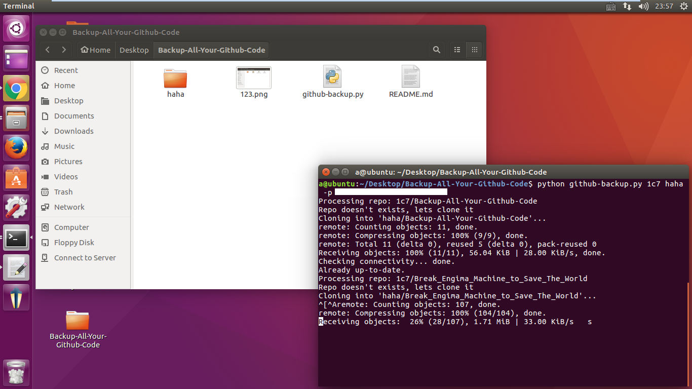
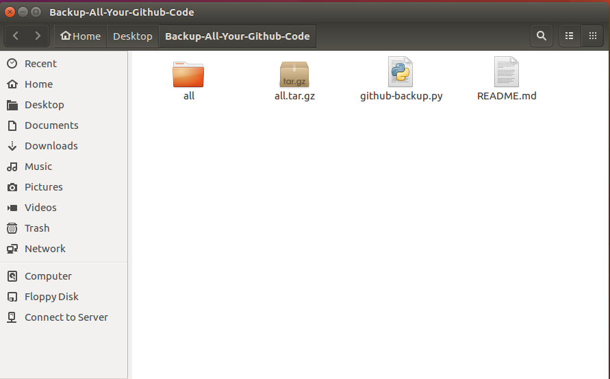

## 如何备份你所有的 Github 代码 (Python)
把代码全部依赖于任何一家云 (Github,Bitbucket,Dropbox..) 都是不合适的  
仔细想清楚如果你所有的 Github 代码都没了, 你是否能承受这个后果  
<br/>

## 备份方法
1. git clone 这个库
```
    git clone git@github.com:1c7/Backup-All-Your-Github-Code.git
```

2. 安装 pygithub3 
```
    sudo pip install pygithub3
```
注意 这是装到 python 2.7 里面去了


3. 使用
```
    python github-backup.py <用户名> <备份的文件夹> -p <密码>
```
例子
```
    python github-backup.py 1c7 all -p 123456
```

4. 
现在等程序自己慢慢 clone 就行了, 等弄完了你自己压缩打个包扔到哪里都行  


程序在 Ubuntu 16.04 LTS 下工作正常  

<br/>
#### 推荐用这个程序的理由
(这里这个 Python 程序是别人写的, 我只是写下用法的介绍而已)  
谷歌你搜 github backup 会有一堆程序  
有些是备份了一些奇怪的格式, 有些是连 wiki, gist 都备份了  
想找个好用的__纯粹备份代码__的还真麻烦, 然后那些家伙文档也写不清楚  
这里推荐的这个算是最省心好用的了  

建议最少半年备份一次  

<br/>
#### 备注
这里这个 Python 程序的原作者已经完全不维护了 (你可以看Python源代码找到那个 github 库)  
要改进直接改进这里这个库就好  


<br/>
#### 改进点
(我没空自己做, 所以写出来, 谁有兴趣可以改进下)  
1. 通过简单的方式跳过特定的库，比如写个配置文件 skip.json  
```
{
    'VideoList', 'Program-Execise'
}
```

2. 标明进度  
比如一开始就说，你一共有 30 个库，   
正在 Clone 第 1 个: xxxx    
正在 Clone 第 2 个: xxxx   

3. 全部完成后是否压缩打包, 以方便复制到其他地方


